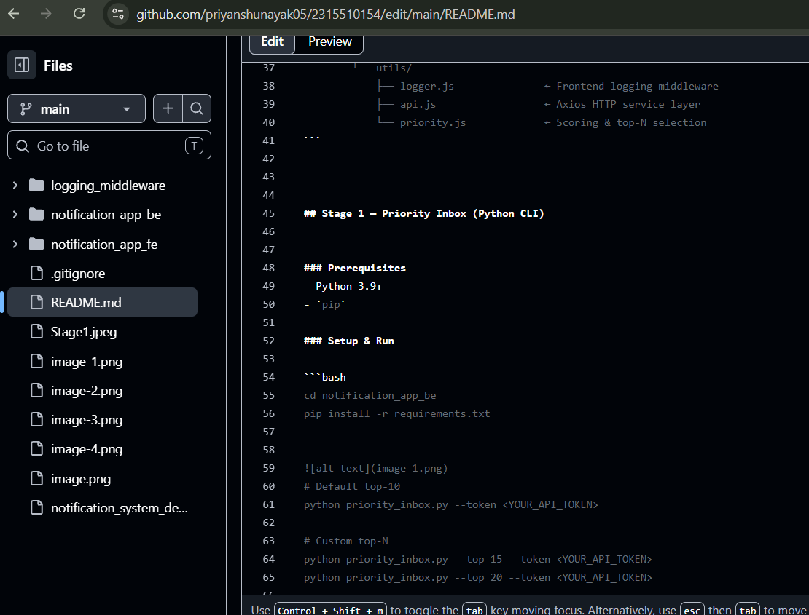
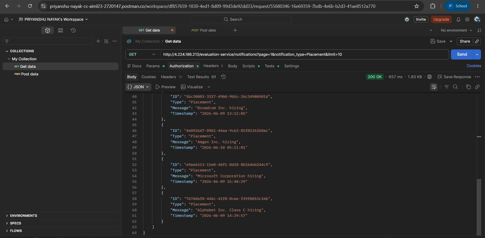
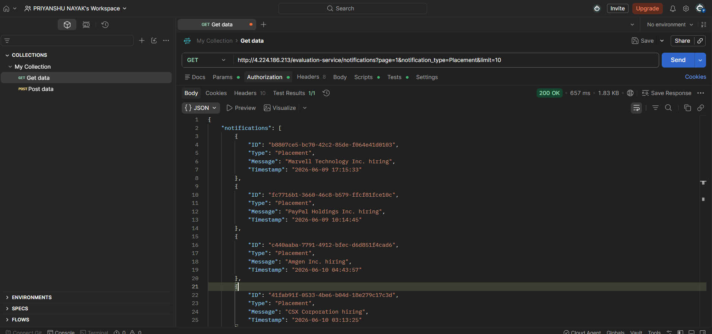

# Campus Notifications Platform

> Real-time priority-aware notification dashboard for GLA University students.
> Covers Placements, Results, and Events with a ranked Priority Inbox.

---

## Repository Structure

```
.
├── .gitignore
├── README.md
├── notification_system_design.md       ← Architecture & design decisions
│
├── logging_middleware/
│   └── logger.py                       ← Shared logging middleware (Python)
│
├── notification_app_be/
│   ├── priority_inbox.py               ← Stage 1: Priority Inbox CLI
│   └── requirements.txt
│
└── notification_app_fe/
    ├── package.json
    ├── .env.example                    ← Copy to .env and add your token
    ├── public/
    │   └── index.html
    └── src/
        ├── index.js                    ← App entry + MUI theme
        ├── App.jsx                     ← Root layout component
        ├── components/
        │   ├── NotificationCard.jsx    ← Individual notification tile
        │   ├── FilterBar.jsx           ← Type filter + Top-N slider
        │   └── StatsBar.jsx            ← Summary counts per type
        ├── hooks/
        │   └── useNotifications.js     ← Central state hook
        └── utils/
            ├── logger.js               ← Frontend logging middleware
            ├── api.js                  ← Axios HTTP service layer
            └── priority.js             ← Scoring & top-N selection
```

---

## Stage 1 — Priority Inbox (Python CLI)

### Prerequisites
- Python 3.9+
- `pip`

### Setup & Run

```bash
cd notification_app_be
pip install -r requirements.txt


# Default top-10
python priority_inbox.py --token <YOUR_API_TOKEN>

# Custom top-N
python priority_inbox.py --top 15 --token <YOUR_API_TOKEN>
python priority_inbox.py --top 20 --token <YOUR_API_TOKEN>

# Or set token via environment variable (recommended)
export NOTIFICATION_API_TOKEN=<token>
python priority_inbox.py --top 10
```

### Priority Algorithm

| Type      | Weight | Score formula                          |
|-----------|--------|----------------------------------------|
| Placement | 3      | `3 × 10⁹ + unix_timestamp_seconds`    |
| Result    | 2      | `2 × 10⁹ + unix_timestamp_seconds`    |
| Event     | 1      | `1 × 10⁹ + unix_timestamp_seconds`    |

A **fixed-capacity min-heap** (size = N) ensures new notifications are ranked in **O(log N)** time. See `notification_system_design.md` for full design rationale.

---

## Stage 2 — React Frontend
### DashBoard


### Prerequisites
- Node.js 18+
- npm 9+

### Setup & Run

```bash
cd notification_app_fe

# 1. Configure API token
cp .env.example .env
# Edit .env → set REACT_APP_API_TOKEN=<your_token>

# 2. Install dependencies
npm install

# 3. Start dev server
npm start
# → http://localhost:3000
```

### Features

| Feature | Description |
|---------|-------------|
| Priority Inbox | Top-N notifications ranked by type weight × recency |
| All Notifications | Full list, optionally filtered by type |
| Type Filter | Toggle between All / Placement / Result / Event |
| Top-N Slider | Choose 5 to 30 priority notifications |
| Read / Unread | Visual distinction; state persisted in localStorage |
| Mark as Read | Click card or use icon button |
| Mark All Read | One-click header button |
| Stats Bar | Live counts: unread, placements, results, events |
| Responsive | Mobile-first grid (1 → 2 → 3 columns) |
| Error Handling | User-friendly error banner with retry |

### Logging
### Logs on PostMan



All API calls and user interactions are traced through the frontend **Logging Middleware** (`src/utils/logger.js`). Open browser DevTools → Console to see structured, colour-coded log output. No bare `console.*` calls are used in application code.

---

## API Reference

```
GET http://4.224.186.213/evaluation-service/notifications
```

| Query Param         | Type   | Description                                 |
|---------------------|--------|---------------------------------------------|
| `page`              | number | Pagination page (default: 1)                |
| `limit`             | number | Results per page (default: 50)              |
| `notification_type` | string | `Placement` \| `Result` \| `Event`          |

**Authorization:** `Bearer <token>` (set via env var, never hard-coded)

---

## Coding Standards

- **Naming**: `camelCase` for JS variables/functions, `PascalCase` for React components, `snake_case` for Python.
- **Comments**: every module, class, and non-trivial function has a docstring / JSDoc block explaining *what* and *why*.
- **Logging**: all observability goes through the shared middleware — no raw `print()`, `console.log()`, or `logging.basicConfig()`.
- **Error handling**: network errors are caught at the service layer, user-friendly messages surface in the UI, full stack traces go to the logger.
- **Secrets**: API tokens are read from environment variables (`.env`) and never committed to the repository.
