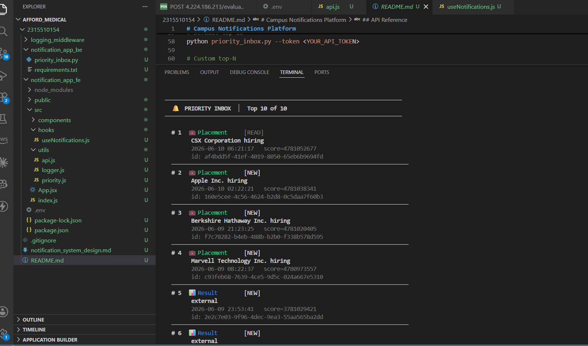
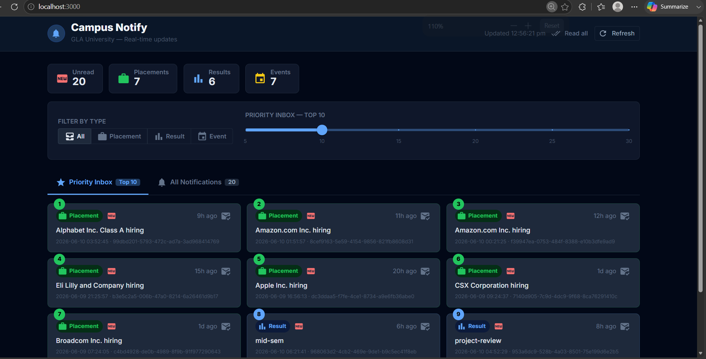

# Notification System Design

## Stage 1


### Overview

The Priority Inbox surfaces the **top N most important unread notifications** from a live API feed without persisting anything to a database.

---

### View 


### Priority Scoring

Every notification receives a **numeric score**:

```
score = weight(type) × 1,000,000,000 + unix_timestamp
```

| Type      | Weight |
|-----------|--------|
| Placement | 3      |
| Result    | 2      |
| Event     | 1      |

Multiplying by 10⁹ guarantees that type weight always dominates recency, while the Unix timestamp (in seconds) breaks ties within the same type so that newer notifications rank higher.

---

### Data Structure: Fixed-Capacity Min-Heap

The `PriorityInbox` class wraps Python's `heapq` module to maintain a min-heap of exactly `capacity` entries, keyed on **negative score** (so the heap's minimum element is the weakest notification currently in the top-N).

```
Heap root = lowest-scoring notification in the top-N "window"
```

#### Why a min-heap of size N?

| Operation              | Complexity |
|------------------------|-----------|
| Insert new notification | O(log N)  |
| Read top-N (sorted)     | O(N log N)|
| Space                   | O(N)      |

For typical values of N (10–20) this is effectively O(1) in practice.

---
### UI dashboard


### Handling New Notifications Efficiently

When a new notification arrives (e.g., via polling or a push event):

1. **Compute its score.**
2. **Compare with the heap root** (the current worst in the top-N):
   - If `new_score > root_score` → `heapreplace` (pop root, push new) → O(log N)
   - Otherwise → discard → O(1)
3. A **`seen_ids` set** prevents duplicates in O(1) average time.

This means the inbox stays accurate with **one heap operation per incoming notification**, regardless of the total volume of notifications.

---

### Deduplication

A `set[str]` of notification IDs is maintained alongside the heap. Before any insert, the ID is checked; if already present, the notification is silently dropped. This costs O(1) amortised time and O(N) extra space.

---

### Logging

All operations (fetch, parse, push, evict, mark-viewed) are instrumented through the custom **Logging Middleware** (`logger.py`). Console / built-in loggers are not used directly. The `@log_call` decorator automatically traces function entry, exit, and any exception for every key function.

---
### Logs on PostMan


### How to Run

```bash
cd stage1
pip install -r requirements.txt

# Top 10 (default)
python priority_inbox.py --token <YOUR_TOKEN>

# Top 15
python priority_inbox.py --top 15 --token <YOUR_TOKEN>
```

---

### Limitations & Future Work

- Currently polls on demand; a production system would use **Server-Sent Events (SSE)** or **WebSockets** for true real-time push, feeding new notifications into `PriorityInbox.push()` as they arrive.
- "Viewed" state is in-memory only; persistence would require a lightweight store (Redis sorted set maps naturally to this structure).
- The scoring formula weights type linearly; a production system might apply **exponential time decay** (`score = weight × e^(−λ·age_hours)`) to better model urgency.
